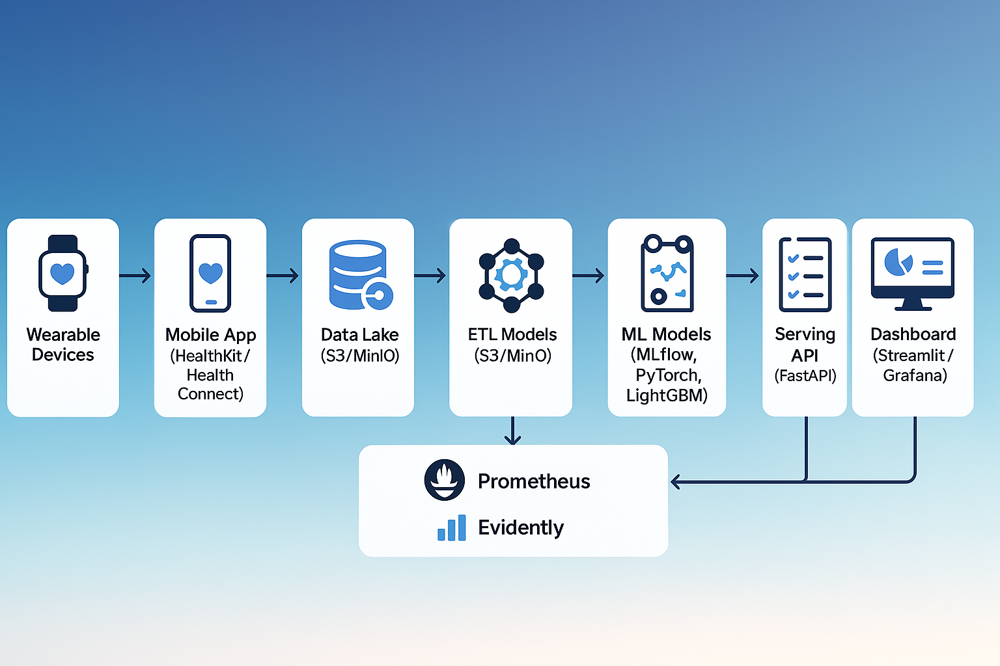

# 🧘‍♀️ MindVitals — AI-Driven Mindfulness & Health State Platform

> **“Measure your mind through your body.”**  
> 스마트워치·스마트폰 생체데이터로 마음의 상태를 읽고,  
> 명상을 통해 회복을 설계하는 인공지능 기반 건강관리 서비스.

---

## 🌍 Overview

**MindVitals**는 웨어러블 및 스마트폰으로부터 수집된 **생체 데이터(HR, HRV, 수면, SpO₂, 피부온도, 활동량, 혈압, 혈당)**를 분석하여  
사용자의 **현재 메디컬·심리 상태를 정량화**하고,  
이에 따라 **맞춤형 명상·호흡·활동 개입 전략**을 제시하는 **AI 디지털 웰니스 플랫폼**입니다.

---

## 🩺 Core Features

| 기능 | 설명 |
|------|------|
| 🔹 **웨어러블 데이터 통합** | Apple HealthKit / Google Health Connect / Samsung Health 연동 |
| 🔹 **실시간 상태 분석** | HRV, 수면, 체온, 활동량, 혈압·혈당 변동 기반 건강 인덱스 계산 |
| 🔹 **AI 기반 개입 추천** | 상태·시간·사용패턴 기반 명상·호흡·수면위생 루틴 자동 제안 |
| 🔹 **지속적 개인화 학습** | 사용자의 반응(HRV 변화·수면질 개선)에 따라 정책 강화학습 |
| 🔹 **대시보드 리포트** | Streamlit 기반 일·주·월 단위 회복률, HRV 트렌드 시각화 |
| 🔹 **확장성** | CGM(혈당계), 혈압계, ECG 등 의료기기 연동을 통한 정밀 모니터링 |

---

## 🧱 System Architecture

> 위 구조는 실제 서비스의 데이터 흐름과 MLOps 아키텍처를 기반으로 구성되었습니다.

### 🔹 데이터 플로우 개요
1. **Wearable Devices** (Apple Watch, Galaxy Watch, CGM, Blood Pressure Monitor)  
2. **Mobile App** (HealthKit / Health Connect)  
3. **Ingest API** (FastAPI)  
4. **Data Lake** (S3 / MinIO)  
5. **ETL & Feature Engineering** (Airflow + Polars)  
6. **ML Models** (LightGBM, PyTorch, MLflow)  
7. **Model Registry** (MLflow)  
8. **Serving API** (FastAPI, REST)  
9. **Dashboard** (Streamlit / Grafana)  
10. **Monitoring Layer** (Prometheus, EvidentlyAI)

---

## 🧠 Machine Learning & Modeling

| 목적 | 알고리즘 | 설명 |
|------|-----------|------|
| **컨디션 스코어링** | LightGBM → Temporal Fusion Transformer | HRV·수면·활동량 기반 일별 회복지수 산출 |
| **스트레스 조기경보** | LSTM / TCN / Transformer | 6~12시간 후 스트레스 리스크 예측 |
| **개입 추천** | XGBoostRanker → Contextual Bandit | 시간·패턴·효과 기반 명상/호흡/활동 추천 |
| **설명가능성** | SHAP / Attention Map | 피처별 기여도 분석 및 사용자 피드백 반영 |
| **모델 관리** | MLflow Model Registry | 실험 관리, 버전 추적, 자동 서빙 파이프라인 |

---

## ☁️ MLOps Pipeline

| 단계 | 도구 | 설명 |
|------|------|------|
| **데이터 수집** | FastAPI + HealthKit/Connect SDK | 웨어러블 데이터 수집 및 표준화 |
| **ETL & Feature Store** | Airflow + Feast + Polars | 시계열 피처 구축 및 자동 스케줄링 |
| **모델 학습** | MLflow + PyTorch | 모델 학습, 실험 추적, 성능 기록 |
| **배포** | Docker + GitHub Actions + FastAPI | 자동 빌드·테스트·서빙 |
| **모니터링** | Prometheus + Grafana + Evidently | 데이터/성능 드리프트 감지, 알림 |
| **저장소** | Postgres + MinIO (S3 호환) | 모델/피처/결과물 저장소 일원화 |

---

## 🧩 Data Schema (요약)

| 컬럼 | 타입 | 설명 |
|--------|------|-------------|
| user_id | string | 익명화된 사용자 식별자 |
| ts | datetime | 타임스탬프 |
| hr | float | 심박수 (bpm) |
| hrv_rmssd | float | 심박변이도 (RMSSD) |
| spo2 | float | 산소포화도 (%) |
| temp_skin | float | 피부/손목 온도 (°C) |
| sleep_stage | enum | REM/Deep/Light/Awake |
| steps | int | 걸음수 |
| activity_mets | float | 활동량(MET) |
| state_score | float | AI가 산출한 상태 점수 (0–100) |

---

## 📊 Example Report Output

| 항목 | 단위 | 예시 |
|------|------|------|
| 회복지수 (Recovery Index) | 0–100 | 78 |
| 스트레스 리스크 | % | 12% (낮음) |
| 수면 효율 | % | 85% |
| 권장 개입 | - | “5분 호흡 + 10분 집중명상” |
| HRV 변화 (1주) | RMSSD (ms) | +21% |

---

## 🧭 Project Roadmap

| 단계 | 목표 | 산출물 |
|------|------|--------|
| **Phase 1** | MVP 구축 (데이터 수집 + 상태 점수) | Airflow + MLflow + Dashboard v1 |
| **Phase 2** | 스트레스 예측 + 개입 추천 | ML 모델 자동화 + 개인화 |
| **Phase 3** | 정책학습 기반 최적화 | Bandit 기반 강화학습 |
| **Phase 4** | 의료기기 연동 / 기업 복지 패키지 | B2B/B2C 하이브리드 서비스 |

---

## 🧠 Tech Stack Summary

| 영역 | 기술 |
|------|------|
| **Backend/API** | Python · FastAPI · Pydantic · Uvicorn |
| **Data & MLOps** | Airflow · MLflow · TimescaleDB · MinIO · Feast |
| **Modeling** | LightGBM · PyTorch · TensorFlow · scikit-learn |
| **Visualization** | Streamlit · Plotly · Grafana |
| **DevOps** | Docker · GitHub Actions · Prometheus |
| **Infra** | Local / EC2 / RDS / S3 |

---

## 🧩 Folder Structure

mindvitals/
├── data_pipeline/
│   ├── ingest/
│   ├── preprocess/
│   └── feature_engineering/
├── models/
│   ├── state_score/
│   ├── stress_predictor/
│   └── recommender/
├── api/
│   └── app.py
├── mlops/
│   ├── airflow_dags/
│   ├── mlflow/
│   └── monitoring/
├── dashboards/
│   └── streamlit_app.py
└── docs/
    ├── architecture.png
    └── datasets.md

---

## 🔐 Ethics & Privacy

- **비진단용 웰니스 서비스**로 의료행위 아님 명시  
- **데이터 최소수집·가명처리·암호화 저장**  
- **사용자 데이터 접근 권한 통제 및 로그 관리**  
- GDPR / HIPAA / 한국 개인정보보호법 준수

---

## 🤖 AI Collaboration

본 프로젝트는 **ChatGPT-5**와의 공동개발(Co-Creation) 형태로 진행됩니다.  
- ChatGPT-5: 아키텍처 설계, 모델링, MLOps 파이프라인, 문서화 지원  
- 사용자: 데이터 수집, 구현, 실험, 결과 해석  
> “AI와 인간이 협업하여, 건강과 마음을 연결하는 새로운 패러다임을 만든다.”

---

## 📜 License
MIT License

---

## 👤 Author & Contact

**Author:** [Your Name]  
**AI Partner:** ChatGPT-5  
**Email:** your.email@example.com  
**Notion:** https://notion.so/mindvitals  
**GitHub:** https://github.com/your-repo-name  

---

## 🧩 Citation

> MindVitals: AI-Driven Mind-Body State Prediction Using Wearable Biosignals (2025)

---

